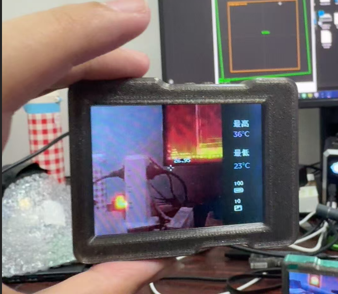
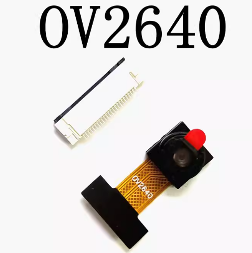
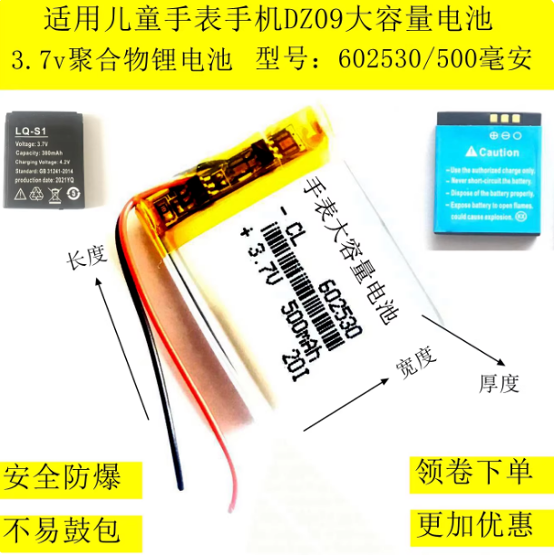
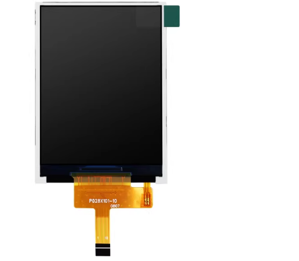
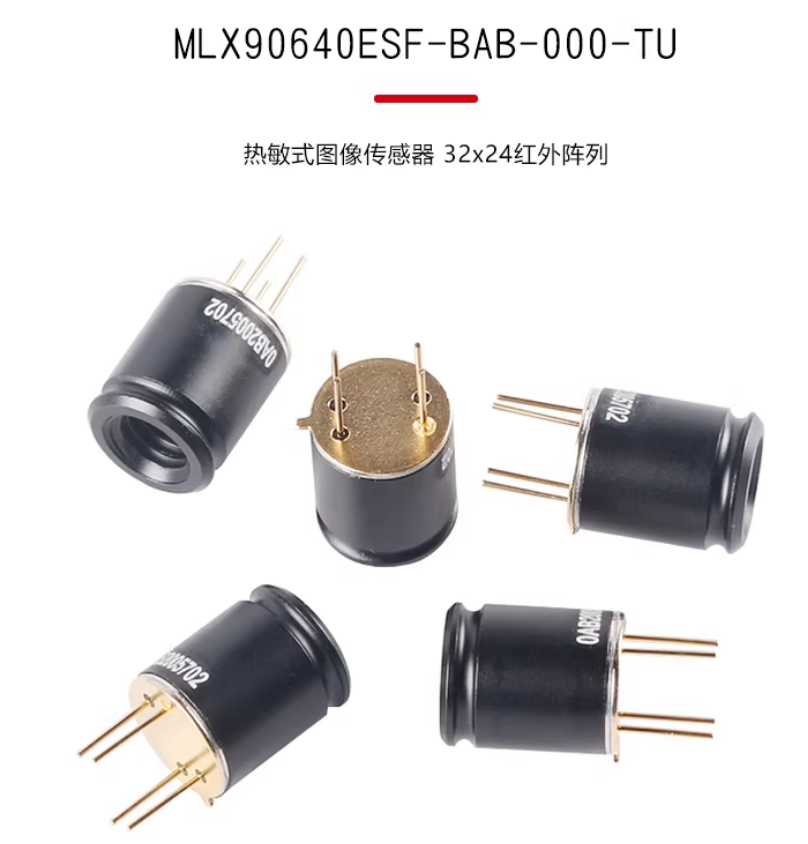
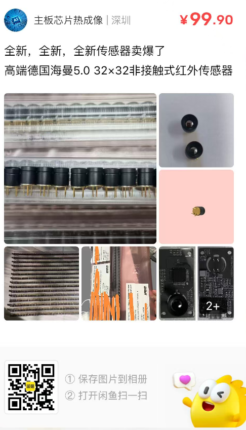

## Umeko Dual Vison Thermal Demos

[视频教程](https://www.bilibili.com/video/BV1iTciz7E7s/)

This project uses PlatformIO to build up firmwares. First you need to install PlatformIO plugins with VSCode to start up your programing.

这个项目使用 PlatformIO 编译固件，首先您应该在VSCODE中安装PlatformIO插件来开始编程或者编译上传固件。这个项目具有教学性质，一步一步教您如何驱动这块开发板实现相应的功能。您可以按数字顺序由浅入深的学习这个项目。

[原理图](Schematic.pdf)

### 可能用得上的物料与链接

- [OV2640](https://item.taobao.com/item.htm?abbucket=18&id=627789434982&mi_id=0000ak-SnEMuR-jih50_J2QsWTFGzepVYVtTbDOiy4ukQS4&ns=1&spm=a21n57.1.hoverItem.2&utparam=%7B%22aplus_abtest%22%3A%2240d64c7aea28c49d19b9c82834b27a49%22%7D&xxc=taobaoSearch&skuId=5698471763808)

- [602530锂电池](https://item.taobao.com/item.htm?spm=tbpc.boughtlist.suborder_itemtitle.1.744d2e8dmZu3fT&id=643350021642&mi_id=0000d3WV6kpuGeAMt06zYXt2AImW57Kf9e5F5cApEyiOroM)

- [2.8寸st7789LCD屏幕](https://item.taobao.com/item.htm?id=665897128566&mi_id=0000mm9jWbgX_rEN8hVAcU-ZdEFUBPkn1smQ8aMfIt5qCVo&spm=tbpc.boughtlist.suborder_itemtitle.1.744d2e8dG1TjTj&skuId=4800376616854)

- 可以选用[MLX90640/MLX90641探头](https://item.taobao.com/item.htm?abbucket=18&id=682465022008&mi_id=0000AwFISFv9ecCuUgCoyu_N-gPCUs4steOFGa-0DGdULVY&ns=1&spm=a21n57.1.hoverItem.5&utparam=%7B%22aplus_abtest%22%3A%22d4af32b6d5d7abec4fc5b5c76469f8bf%22%7D&xxc=taobaoSearch&skuId=4881088648608)

- 也可以选用 海曼5.0热成像探头